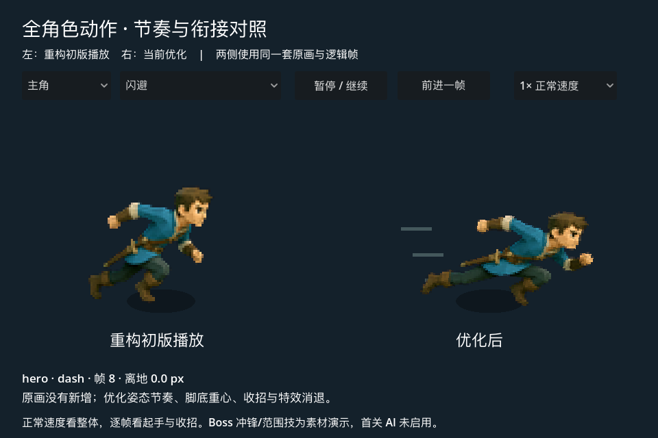
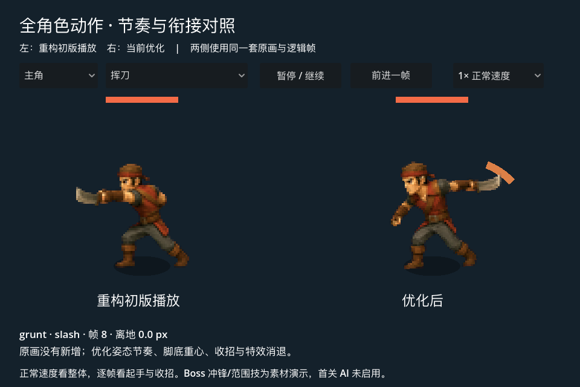
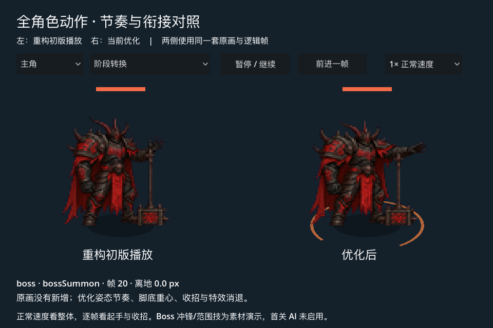
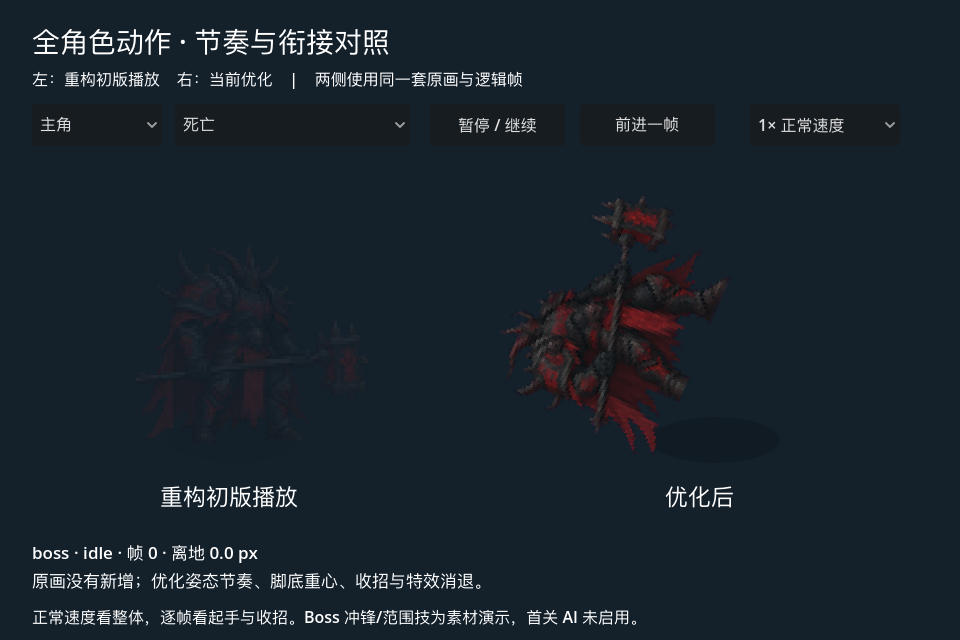

# Godot 全角色动作审计与第二轮优化

2026-09-27。范围为当前 Godot 首关的主角、杂兵、Boss，以及图集中已有但首关 AI 未启用的
Boss 冲锋/范围技；旧 Web/Cocos 和尚未迁移的职业、敌人不在这次改动范围。

## 逐类结论

| 动作/系统 | 发现 | 当前处理 |
|---|---|---|
| 全角色待机 | 姿态变化很小，像定格图 | 添加轻微呼吸，绕脚底缩放，不产生脚底漂移 |
| 全角色移动 | 四原画步态有限，重心变化生硬 | 每轮两次起伏，加小幅重心变化，动作切换时平滑收敛 |
| 主角三连击 | 收招定格，突然切回新动作 | 按前摇/命中/随挥/还原采样，最后回待机；重心独立平滑，不延迟命中帧 |
| 主角跳跃/跳劈 | 上轮已修复接招高度重置 | 保留修正，剑弧和命中数字跟随当前高度；空中受击逐步下降 |
| 主角闪避 | 四张图均分，出力姿态和高速位移错位 | 起步/加速/冲刺/站起按实际时序安排，停速后站起，添加短速度线 |
| 主角技能/处决 | 复用攻击图且末帧长时间停住 | 完整回到准备姿态；范围效果扩散并消退；专属原画仍缺失 |
| 杂兵挥刀 | 接触姿态不是主角相同列号 | 按该图集第 2 格挥刀、第 3/4 格随挥采样，补出手弧线 |
| 敌人收招 | activeTo 后可以再次起手，跳过恢复与名额冷却 | AI 仅在 idle/move 起手，先收招，再归还名额并冷却 |
| 全角色受击 | 先播放站立格数帧，看起来反应慢 | 命中立即受力，随后回弹、还原；少量重心位移不影响碰撞位置 |
| 全角色死亡 | 原地淡出；玩家失败后 dead_frames 不再推进 | 倒地后延迟淡出；失败态只收尾死亡，禁止继续 AI/伤害/移动 |
| Boss 重砸 | 长前摇与随挥只停图，缺少出力节奏 | 前摇后仰、释放前压、缓慢收回；出手弧线随时间消退 |
| Boss 蓄力/冲锋 | 无 hitbox 的蓄力不画预警；冲锋末段停图 | 按 telegraph 自身形状画方向；冲锋速度线、收招回准备姿态 |
| Boss 范围技 | 只有姿态，没有释放效果 | 判定外沿保持稳定，内环扩散并消退；没有启用新的 AI 技能 |
| Boss 阶段转换 | 举手姿态缺少聚力/释放感 | 按阶段分配姿态时长，增加脚下短暂聚力环 |
| 伤害数字/火花 | 暂停仍运行；换房可能残留 | 主场景统一推进，暂停冻结、换房清空；数字上浮减速，火花衰减 |
| 相机、场景、HUD | 相机已有平滑，场景装饰/菜单多数为静态 | 保留现有实现，不给所有元素添加持续动画 |

角色形变由逻辑 tick 推进，命中停顿时与角色一起冻结。火花和数字允许在短 hitstop 中
继续消退，但手动暂停与后台暂停都冻结。图片没有交叉透明混合，避免刀和手臂出现双影。

## 对战斗规则的影响

伤害、命中窗口、玩家取消/无敌/移动参数保持原数据。
敌人修复重复起手后，实际攻击频率会下降，原配置的收招与冷却现在才完整执行；
这不是纯视觉改动。相同机器人样本从约 50 秒变为约 40 秒，仍击败 6 个敌人通关。
样本只证明流程可完成，不能用来认定玩家难度更合理；需要真人试玩评估恢复窗口。

## 检查与证据

- `npm run validate:godot`：109 项通过。
- 逐逻辑帧检查主角 11、杂兵 4、Boss 8 个动作的行/列合法性、接触姿态和攻击还原。
- 新增敌人连续完整出招/归还名额/冷却、空中受击、死亡完成、暂停特效、换房清理回归。
- `godot --path native/godot --script tests/all_motion_visual_check.gd`：24 个对照场景真实 GL 渲染，
  在通用时间点及攻击判定窗口内截图；输出在 `native/godot/output/all-motion-review/`。
- 实际逐帧按钮信号验证通过，未把引擎级控件验证称为系统键鼠或真机测试。
- 正式首页/战斗/奖励/Boss/压力场景重新渲染通过。Apple M2、50 单位、12 秒、1441 样本，
  平均约 8.334 ms、P95 8.333 ms，静态内存约 187.34 MiB。不是移动设备性能结论。
- `git diff --check` 通过。代码与素材没有自动提交。






## 直接查看

```sh
npm run dev:motion-lab
```

选择主角/杂兵/Boss，然后选择动作。左右两侧使用相同当前逻辑帧，左侧重现重构初版的
姿态播放和高度算法，右侧为当前效果。对照场不运行伤害判定，不能用于比较敌人 AI 攻击频率；
正式首关用 `npm run dev:godot` 试玩。

## 原画仍需补齐的部分

这轮没有新增原画，程序重心变化不是骨骼动画，也不能替代手、脚、刀的真实中间姿态。
移动仍是四姿态；slash3、skill、execute、airSlash 仍借用 slash2；jump 借用 move。
本轮所有攻击的最后准备姿态改为 idle 首帧，导出时可能多出一个播放条目，不能称为新生成帧。

后续原画优先级：主角完整八姿态移动 → 主角独立第三段与跳劈 → 杂兵步态 → Boss 重砸中间姿态。
每个动作先通过正常速度与动作切换验收，再扩展整套；上一轮两张失败 AI 候选继续保持未采用状态。
