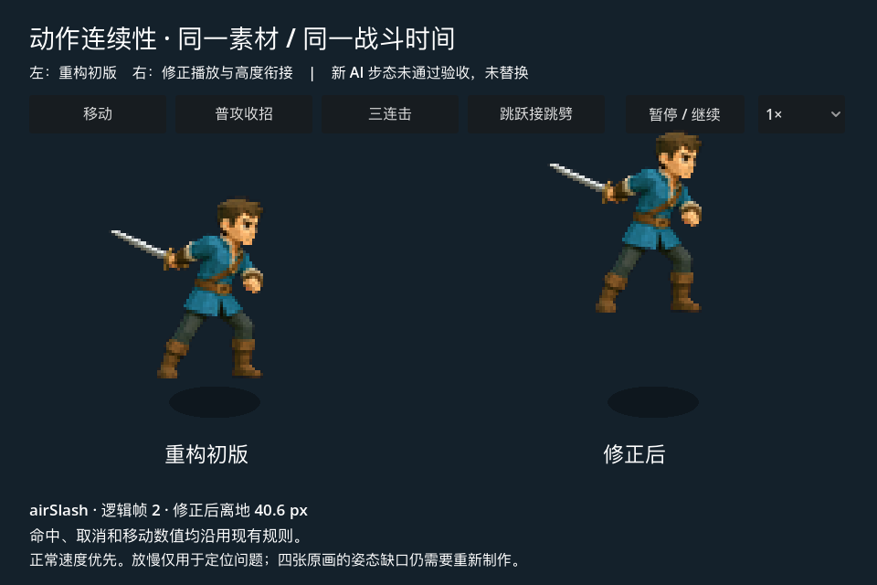
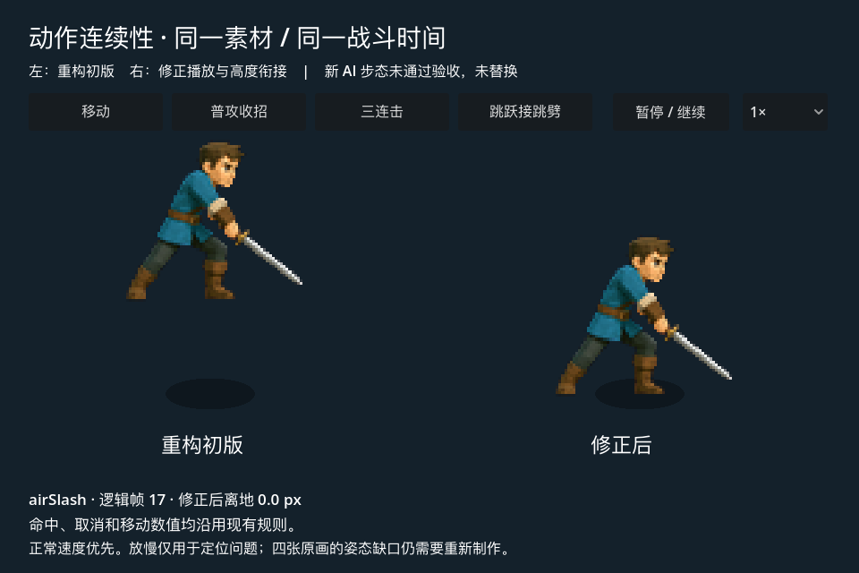
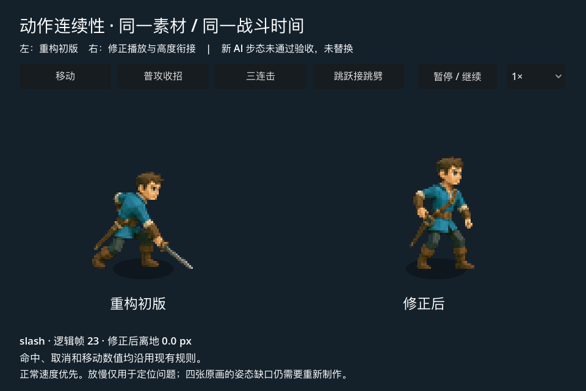

# 主角动作连续性：实战试点

2026-09-27，Godot 首关重构版。保留现有主角外观与正式 hero-v2 原图。

## 结论与已落地修正

不连贯由原画缺口和播放逻辑共同造成，只增加图片数不能解决全部问题。

| 问题 | 证据 | 本轮处理 |
|---|---|---|
| 移动显得碎、抖 | 原式 abs(sin(4πt)) 在一轮内产生四次起伏 | 改成每轮两次起伏，原画仍为四张 |
| 普攻收招像卡住，接待机突变 | activeTo 后始终停在第 4 张随挥图 | 保留随挥，再返回起手姿态；命中和取消时机保持原值 |
| 跳跃接跳劈突然贴地再弹起 | 每次换动作重新计算整段 sin 高度 | 继承接招时高度，按跳劈腾空窗口下降 |
| 能接地面攻击时人仍浮空 | 旧高度按动作总长，腾空窗口却提前结束 | 腾空窗口末帧高度归零 |
| 空中像走路，三段动作辨识度弱 | jump 映射 move；slash3 等映射 slash2 | 跳跃暂固定屈膝帧；专属原画仍待制作 |

正式逻辑仍为 60 Hz，伤害、速度、无敌、取消窗口、命中停顿未改。高度只改变表现，
由同一 tick 更新；仅渲染或命中停顿期间不自行推进。`animation_pose.gd` 集中维护采样。
收招只是已有姿态的重新编排，尚不是完整的攻击动画重绘。

## 下一版原画设计

保留低多边形卡通风格、青蓝上衣、棕发、单手剑与固定三分之四侧面。
以一套八姿态移动为第一道验收，确认步态后再制作攻击，不同时批量生成全部动作。

| 动作 | 原画目标 | 设计要点 |
|---|---|---|
| move | 8 张 | 左落地→承重→经过→蹬离→右落地→承重→经过→蹬离；刀不随步伐乱甩 |
| idle | 4 张 | 小幅呼吸，脚底固定；与移动、收招的入口姿态兼容 |
| slash / slash2 | 各 6–8 张 | 分别横切、反向回斩；蓄力、挥击、随挥、还原四阶段；挥击对齐现有命中窗口 |
| slash3 | 6–8 张 | 独立重斩，轮廓与前两段区分，末尾回到共享准备姿态 |
| jump | 4–6 张 | 压低、起跳、腾空、落地；腾空不播放走路 |
| airSlash | 6 张 | 空中举剑、劈落、触地、缓冲、还原；入口接住跳跃轮廓 |

这是设计目标，尚未制作完成。帧数不等于动作总长：使用逐帧 duration 将原画映射到现有
逻辑窗口。96×96 输出单格、脚底 y=90、统一角色比例继续沿用；新增可变帧数需要先升级
Godot 的 manifest 消费方式，不能直接把八列图塞进当前四列 Sprite2D。

验收以正常速度、实际显示尺寸为先，慢放定位细节；检查左右腿交替、武器手别、脚底、
循环接缝和动作切换。至少在移动→停步、三连击、跳跃→跳劈→地面攻击中复核。

## 两轮生图试验：未采纳

使用内置 image_gen，参考旧主角图集生成八姿态移动，再定向修正对侧腿。
两个结果上下排仍接近重复半步态，不能作为完整左右交替步态交付。
源图保存在 `move-rejected-1.png`、`move-rejected-2.png`，完整提示词见 [PROMPTS.md](PROMPTS.md)。
没有替换正式素材，也未声称这些图经过 sprite-gen 或可直接运行。

## 复现与验证

在 frontier-brawler 根目录运行：

```sh
npm run dev:motion-lab
npm run validate:godot
npm run export:motion-review
godot --path native/godot --script tests/motion_visual_check.gd
godot --path native/godot --script tests/visual_check.gd
```

- 54 项检查通过，包括命中帧保持、收招、步态起伏、跳劈高度继承、落地窗口和渲染不推进高度。
- 原有机器人仍通过正式战斗完成首关；不是手感、平衡或移动端验收。
- 真实 Godot 对照场截图：





## 工具库实战复用

实际采样器导出 `native/godot/output/motion-review-source/{before,after}` 的 JSON、PNG、配方。
下面以 after 为例；输出目录必须不存在：

```sh
../ai-asset-pipeline/.venv-cutout/bin/python ../ai-asset-pipeline/src/asset_bundle.py \
  --recipe native/godot/output/motion-review-source/after/recipe.json \
  --input native/godot/output/motion-review-source/after/aseprite.json \
  --aseprite --out output/motion-review-after-v1
```

本次 before / after 均完成打包，输出带逐帧时长的独立预览与来源记录。
新版攻击显示五个播放条目，其中准备姿态被再次引用，仍只有四张原画。
毫秒导出按 60 Hz 四舍五入，存在毫秒级取整；预览不包含高度、地面位移、剑弧和命中反馈，
这些必须在 Godot 对照场与正式战斗中看。该链路适合跨项目复用；游戏状态和命中规则留在游戏仓库。

本次教训已回写 character-motion-kit 的步态验收说明，并加入素材包人工检查清单。
